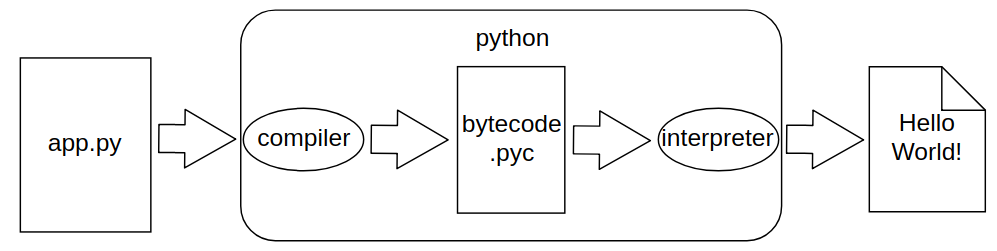

# PYTHON 101

 <!-- .element: style="width: 200px; height: 200px; border: none; background: none" -->

///s


Guido van Rossum <!-- .element: class="fragment" -->


///s

## What is python?

* High-level, interpreted programming language
* First appeared in 1991. (Java 1995, C# 2000)


*Also not a snake.*  <!-- .element: class="fragment" -->

///s


## Python is

* Dynamically typed
* Strongly typed

///v

## Dynamically typed?

Python
```python
a = 5
a = "Something"
b = a.length()
```
Java
```java
String a = "Something";
a = 14; // Nope
```

///v

## Strongly typed?

Python
```python
> 5 + "Nope"
>>> Traceback (most recent call last):
>>>   File "<stdin>", line 1, in <module>
>>>TypeError: unsupported operand type(s) for +: 'int' and 'str'
```

JavaScript
```javascript
> 0 + "h God Why?"
>>> "0h God Why?"
```

///s

# Why python?

* Easy to learn <!-- .element: class="fragment" -->
* Clear, concise syntax <!-- .element: class="fragment" -->
* Fast development time <!-- .element: class="fragment" -->
* Huge standard library (batteries included) <!-- .element: class="fragment" -->
* Huge community <!-- .element: class="fragment" -->
* No curly braces <!-- .element: class="fragment" -->

///v


///v

## Rise of Python

> Python has risen in the ranks, surpassing C# this year, much like it surpassed PHP last year.

[Stack Overflow Survey 2018](https://insights.stackoverflow.com/survey/2018/#most-loved-dreaded-and-wanted)

///v

> Python has a solid claim to being the fastest-growing major programming language.

[Incredible growth of Python - SO Blog](https://stackoverflow.blog/2017/09/06/incredible-growth-python/)

///s

## What is Python used for?

* Web development (django, flask, tornado) <!-- .element: class="fragment" -->
* Machine learning (tensorflow) <!-- .element: class="fragment" -->
* Science (scipy, numpy, jupyter) <!-- .element: class="fragment" -->
* Big data, data gathering (web scraping) <!-- .element: class="fragment" -->
* Scripting (devops, testing) <!-- .element: class="fragment" -->
* IoT <!-- .element: class="fragment" -->

///s

## Who uses Python?

Splunk, Google, Facebook, Spotify, Reddit, Netflix, Quora, Instagram, NASA, Toyota, Evernote, Nasdaq, Lego, Atlassian, Dropbox, Mozilla, Yahoo...

///s

# But Python is slow!

* Benchmark performance - real world performance <!-- .element: class="fragment" -->
* Development time <!-- .element: class="fragment" -->
* Still too slow? Maybe python is not suitable for your project. <!-- .element: class="fragment" -->

///s

## Instagram

* Written in Python (Django)
* 3B+ registered users
* 800 million monthly active users

///s

# Python interpreters

* **CPython**
* Jython - compiles into Java byte code <!-- .element: class="fragment" -->
* IronPython - .NET Common Language Runtime <!-- .element: class="fragment" -->
* Cython - compiles Python to C and C++  <!-- .element: class="fragment" -->
* Google's Grumpy - compiles Python to Go <!-- .element: class="fragment" -->
* Skulpt - In-browser implementation of Python <!-- .element: class="fragment" -->
* ... <!-- .element: class="fragment" -->

///s

# CPython

///v

```bash
$ python3 app.py
Hello World!
```

*Magic!*

///v


///v



///v

CPython Compiler Output (for humans)

```bash
$ python3 -m dis app.py 
  1           0 LOAD_NAME                0 (print)
              2 LOAD_CONST               0 ('Hello world!')
              4 CALL_FUNCTION            1
              6 POP_TOP
              8 LOAD_CONST               1 (None)
             10 RETURN_VALUE
```

///v

CPython Interpreter
```c
// ceval.c
main_loop:
    // ...
    for (;;) {
        switch (opcode) {
        TARGET(LOAD_FAST) {
            PyObject *value = GETLOCAL(oparg);
            if (value == NULL) {
                format_exc_check_arg(PyExc_UnboundLocalError,
                                     UNBOUNDLOCAL_ERROR_MSG,
                                     PyTuple_GetItem(co->co_varnames, oparg));
                goto error;
            }
            Py_INCREF(value);
            PUSH(value);
            FAST_DISPATCH();
        }

        PREDICTED(LOAD_CONST);
        TARGET(LOAD_CONST) {
            PyObject *value = GETITEM(consts, oparg);
            Py_INCREF(value);
            PUSH(value);
            FAST_DISPATCH();
        }

        PREDICTED(STORE_FAST);
        TARGET(STORE_FAST) {
            PyObject *value = POP();
            SETLOCAL(oparg, value);
            FAST_DISPATCH();
        }

        TARGET(POP_TOP) {
            PyObject *value = POP();
            Py_DECREF(value);
            FAST_DISPATCH();
        }
// ...
```
///s

## PYTHON2 OR PYTHON3

* Python 2.7 will not be maintained past 2020. <!-- .element: class="fragment" -->

///s

## Now some code

///s

### Variable types

///v

Numeric Types
```python
a = 5  # int
b = 5.0 # float
c = 2-2j # complex
```
///v

Sequence Types

* List
* Tuple (immutable list, kind of)
* Range (immutable sequence of numbers)

///v

```python
a = [1, 2, "Hello"] # List
b = ("World", 3) # Tuple
c = range(3, 9) # Range
```

```python
>>> for i in range(3): 
...     print(i)
0
1
2
```

///v

Common Sequence Operations
```python
x in s
x not in s
s + t # concatenates s and t
s * n # equivalent to adding s to itself n times
s[i]
s[i:j]
len(x)
min(x)
max(x)
s.index("Hello")
s.count("World")
```

///v

Text Sequence Type (str)
```python
a = "Hi"
b = 'Use double quotes "here"'
multiline = '''Henlo
It is me'''
another_multiline = (
    'This has no whitespace '
    'in between.'
)
```

* Immutable

///v

Set

```python
a = {1, 2, "Hello"}
a[0] # TypeError: 'set' object does not support indexing
b = {[1, 2], 2, 3} # TypeError: unhashable type: 'list'
```

* Unordered
* Unique

///v

Mapping Type - Dictionary

```python
a = {'one': 1, 'two': 2, 'three': 3}
b = dict(one=1, two=2, three=3)
b['one'] # 1
b['two'] = 6 # {'one': 1, 'two': 6, 'three': 3}
del b['one'] # {'two': 6, 'three': 3}
```

///v

Other Types

* Null Object - `None`
* Boolean Values - `True` / `False`
* And many more

///v

Collections module

* namedtuple
* deque
* Counter
* defaultdict

///s

## Flow Control Statements

///s

### IF

```python
if x > 0:
    print("Positive number")
elif x < 0:
    print("Negative number")
else:
    print("Zero")
```

///v

```python
user = User()
if user:
    # Do things
    pass
```
Same as:
```python
if bool(user):
    # Do things
    pass
```

///v

```python
class User(object):
    def __bool__(self):
        # Custom logic
        return True
```
///s

### FOR

///v

JavaScript
```javascript
let items = ["Foo", "Bar", "Baz"];
for(let i=0; i < items.length; i++) {
    console.log(items[i]);
}
```

Python <!-- .element: class="fragment" -->
```python
items = ["Foo", "Bar", "Baz"]

for i in range(len(items)):
    print(items[i])
```

<!-- .element: class="fragment" -->

* Please don't. <!-- .element: class="fragment" -->

///v

* Iterates over the items of any sequence, in the order that they appear in the sequence.

```python
items = ["Foo", "Bar", "Baz"]

for item in items:
    print(item)
>>> Foo
>>> Bar
>>> Baz
```

///v

If you really need an index
```python
items = ["Foo", "Bar", "Baz"]

for i, item in enumerate(items):
    print(i, item)
>>> 0 Foo
>>> 1 Bar
>>> 2 Baz
```

///v

* `continue` skips one iteration
* `break` breaks the for loop

///v

Else, what?

```python
items = ["Foo", "Bar", "Baz"]

for i, item in enumerate(items):
    if item == "Baz":
        break
    print(i, item)
else:
    print("It didn't break")
>>> 0 Foo
>>> 1 Bar
```

///v

```python
items = ["Foo", "Bar", "Spam"]

for i, item in enumerate(items):
    if item == "Baz":
        break
    if item == "Bar":
        pass  # I'll do this later
    print(i, item)
else:
    print("It didn't break")
>>> 0 Foo
>>> 1 Bar
>>> 2 Spam
>>> It didn't break
```
* Else clause is triggered when `break`s are not


///s

### WHILE

///v

```python
items = ["spam", "eggs", "foo"]
while items:
    print(items.pop())
>>> spam
>>> eggs
>>> foo
```

///v

* Else again

```python
items = ["spam", "eggs", "foo"]
while items:
    print(items.pop()) 
else:
    print("Didn't break")
>>> foo
>>> eggs
>>> spam
>>> Didn't break
```

///s

### TRY EXCEPT

///v

```python
try:
    json.load('data.json')
except ValueError:  # Exception type is optional
    print('Invalid file format.')
except Exception:
    print("Didn't see this coming")
else:
    # This is ran only when exception isn't raised
    print("No errors")
finally:
    pass # This is ran every time
```
///s

### SWITCH

* Nope. <!-- .element: class="fragment" -->

///s


### FUNCTIONS


///v

```python
def add_numbers(a, b):
    return a + b

add_numbers(1, 4)
>>> 5

add_numbers
>>> <function add_numbers at 0x7f6bfb2b1e18>
```

* If there is no return statement `None` is returned implicitly

///v

* First class citizens.

```python
def run_function(func, arg1, arg2): # There is a better way
    return func(arg1, arg2)

run_function(add_numbers, 1, 5)
>>> 6
```

```python
a = add_numbers
a(1, 4)
>>> 5
```

///v

```python
def increment(step):
    def add_numbers(b):
        return step + b
    return add_numbers

increment_by_five = increment(5)
increment_by_five(5)
>>> 10
increment_by_five(100)
>>> 105
```

///v

### Scopes

* You can access any variable from outer scopes <!-- .element: class="fragment" -->
* If you want to modify outer scope variable,  you are doing it wrong <!-- .element: class="fragment" -->

///v

### Accessing

```python
x = 5
def func():
    def another():
        print(x)
    another()
func()
>>> 5
```


```python
x = 5
def func():
    x = 999
    def another():
        print(x)
    another()
func()
>>> 999
```

<!-- .element: class="fragment" -->


///v

### Modifying

global
```python
x = 5
def func():
    def another():
        global x
        x = 50
    another()
print(x)
>>> 5
func()
print(x)
>>> 50
```

```python
globals()
>>> {'__name__': '__main__', ... 
'__builtins__': <module 'builtins' (built-in)>, 
'x': 50, 'func': <function func at 0x7f8e4a91fb70>}
```

<!-- .element: class="fragment" -->

///v

nonlocal
```python
def func():
    x = 42
    def another():
        nonlocal x
        x = 43
    print("Before calling `another`: " + str(x))
    another()
    print("After calling `another`: " + str(x))

x = 3
func()
>>> Before calling another: 42
>>> After calling another: 43
print("x in main: " + str(x))
>>> x in main: 3

```

///v

* Don't use this unless you know what you are doing.
* Probably a good indicator that your code is bad.

///v

#### Default arguments

```python
def increment(number, step=5):
    return number + step

increment(5)
>>> 10
increment(5, 1)
>>> 6
```

* Use only immutable arguments for default parameters to avoid headache. <!-- .element: class="fragment" -->

///v

```python
def add_to_list(item, l=[]):
    l.append(item)
    return l

add_to_list(4)
>>> [4]
add_to_list(10)
>>> [4, 10]
```

///v

#### Positional and Keyword arguments

```python
def parrot(voltage, state='a stiff', action='voom'):
    print("-- This parrot wouldn't", action, end=' ')
    print("if you put", voltage, "volts through it.")
    print("-- It's", state, "!")
```

* Valid calls

```python
parrot(1000)                                          # 1 positional argument
parrot(voltage=1000)                                  # 1 keyword argument
parrot(voltage=1000000, action='VOOOOOM')             # 2 keyword arguments
parrot(action='VOOOOOM', voltage=1000000)             # 2 keyword arguments
parrot('a million', 'bereft of life', 'jump')         # 3 positional arguments
parrot('a thousand', state='pushing up the daisies')  # 1 positional, 1 keyword
```

///v

```python
def parrot(voltage, state='a stiff', action='voom'):
    print("-- This parrot wouldn't", action, end=' ')
    print("if you put", voltage, "volts through it.")
    print("-- It's", state, "!")
```

* Invalid calls

```python
parrot()                     # required argument missing
parrot(voltage=5.0, 'dead')  # non-keyword argument after a keyword argument
parrot(110, voltage=220)     # duplicate value for the same argument
parrot(actor='John Cleese')  # unknown keyword argument
```

///v

#### `*` and `**`

```python
def my_func(*args, **kwargs): # `args` and `kwargs` is just a convention
    print('Got args: ' + str(args))
    print('Got keyword args: ' + str(kwargs))

my_func(1, 'second_arg', first_kw=5, second_kw='Hello')
>>> Got args: (1, 'second_arg')
>>> Got keyword args: {'first_kw': 5, 'second_kw': 'Hello'}
```

```python
def add_numbers(*numbers):
    return sum(numbers)

add_numbers(2, 3, 5)
>>> 10
```
<!-- .element: class="fragment" -->

///v

#### Decorators

```python
@my_decorator
def func(a, b):
    pass

# Equal to
func = my_decorator(func)
```

///v

#### Lambda

* Inline functions
* Syntactically restricted to a single expression

```python
def add_numbers(a, b):
    return a + b

add_numbers = lambda a, b: a + b

filter(lambda a: a > 2, [1, 2, 3])
>>> [3]
```

///s

## Classes

///v

```python
class Dog(Animal):  # Subclasses Animal

    kind = 'canine'         # class variable shared by all instances

    def __init__(self, name): # Self (this) is written explicitly
        self.name = name    # instance variable unique to each instance

>>> fido = Dog('Fido')  # Ignore self when calling
>>> buddy = Dog('Buddy')
>>> fido.kind                  # shared by all dogs
'canine'
>>> buddy.kind                 # shared by all dogs
'canine'
>>> fido.name                  # unique to fido
'Fido'
>>> buddy.name                 # unique to buddy
'Buddy'
```

///v

#### Classmethod and staticmethod

```python
class Dog(Animal):
    kind = 'canine'

    @staticmethod
    def random_colar_color():
        return random.choice(['red', 'blue'])
    
    @classmethod
    def get_kind(cls):  # gets class as first argument
        return cls.kind
```

///s

# Packaging

///s

## Packages and Modules

///v

Example structure:
```
http                 # package
├── client           # package
│   ├── __init__.py
│   └── requests.py  # module
├── __init__.py
└── server           # package
    ├── cookies.py   # module
    └── handler.py   # module
```

///v

### When imported:
* Modules are ran from top to bottom. (only first time)
* Created module object is stored in `sys.modules` mapping
* Local variable is bound to represent that module object

///v

### Import statements

```
http
├── client
│   ├── __init__.py
│   └── requests.py
├── __init__.py
└── server
    ├── cookies.py
    └── handler.py
```

```python
import http                 # http imported and bound locally
import http.client.requests # http.client.requests imported, http bound locally
import http.client.requests as req # http.client.requests imported and bound as req
from http.server import handler # http.server.handler imported and http.server.handler bound as handler

from http.server.handler import BasicHandler # binding class from ...cookies module
from http.client.cookies import parse_cookies # binding function from ...cookies module
```

///v

### sys.modules

```python
import sys
import http.client.requests as req

sys.modules['http']
>>> <module 'http' from 'http/__init__.py'>

sys.modules['http.client']
>>> <module 'http.client' from 'http/client/__init__.py'>

sys.modules['http.client.requests']
>>> <module 'http.client.requests' from 'http/client/requests.py'>

http # NameError: name 'http' is not defined
req
>>> <module 'http.client.requests' from 'http/client/requests.py'>
```
///v

### Import `*`

```python
from math import *
```
* Will introduce everything that doesn't start with `_` to namespace
(or import everything that `__all__` specifies)
* Will also make code unreadable  <!-- .element: class="fragment" -->

```python
from math import *
abs(-2) + floor(2.3) # Where did this come from?

import math
math.abs(-2) + math.floor(2.3)
```
<!-- .element: class="fragment" -->

///v

#### `if __name__ == '__main__'`

* Each module has a name attribute
* `"__main__"` is the name of the scope in which top-level code executes

///v

Use this to your advantage
```python
# zipfile.py
import sys

def create_zip(directory, output_name):
    # Creates zip from directory
    pass

if __name__ == '__main__':
    create_zip(sys.argv[1], sys.argv[2])
```

```bash
python zipfile.py my_dir/ output.zip  # __name__ in zipfile will be `__main__`
```

```python
from zipfile import create_zip # create zip won't be ran, __name__ is `zipfile`
create_zip('my_dir', 'output.zip')
```

///v

### How python finds modules?

///v

#### Sys.path

```python
import sys
sys.path
>>> ['', 
    '/usr/lib/python36.zip', 
    '/usr/lib/python3.6', 
    '/usr/lib/python3.6/lib-dynload',
    '/usr/local/lib/python3.6/dist-packages',
    '/usr/lib/python3/dist-packages']
```

* `sys.path` is assembled from `PYTHONPATH` and installation-dependent defaults
* Python searches paths from left to right

///v

#### PYTHONPATH

* `PYTHONPATH` allows you to extend default search path for module files
* Can contain multiple paths separated with OS path separator <!-- .element: class="fragment" -->

```bash
export PYTHONPATH="/home/savo/Downloads:/home/savo/Documents"
python3
  ... import sys
  ... sys.path
  ... ['', '/home/savo/Downloads', '/home/savo/Documents', 
  '/usr/lib/python36.zip', 
  '/usr/lib/python3.6', '/usr/lib/python3.6/lib-dynload', 
  '/usr/local/lib/python3.6/dist-packages', 
  '/usr/lib/python3/dist-packages']
```

<!-- .element: class="fragment" -->

///v


* If python script is ran (`python myscript.py`), parent dir of the script
is automatically added to the front of `sys.path` (even before `PYTHONPATH`s) 

* If python is ran in interactive mode, empty string is prepended which means that
working directory should be searched first.  <!-- .element: class="fragment" -->

* External modules are installed via `pip` which is preferred python package manager. 
Installed packages are stored into `dist-packages` directory

 <!-- .element: class="fragment" -->

///s

## CODING STYLE

### PEP8 <!-- .element: class="fragment" -->

///s

## What we didn't cover?

* (Most of) Decorators
* Generators
* `with` statement (context managers)
* Relative imports (`from .bar import foo`)
* Typing
* Docstring
* Virtualenv

///s

# Sources

* [StackOverflow survey 2018](https://insights.stackoverflow.com/survey/2018/)
* [Incredible growth of Python - SO Blog](https://stackoverflow.blog/2017/09/06/incredible-growth-python/)
* [Number of instagram users](https://www.statista.com/statistics/253577/number-of-monthly-active-instagram-users/)
* [Instagram at PyCon](https://www.youtube.com/watch?v=66XoCk79kjM)
* [CPython on Github](https://github.com/python/cpython)
* [Python 2.7 EOL countdown](https://pythonclock.org/)
* [Python3 Standard Types](https://docs.python.org/3/library/stdtypes.html)
* [Hashables in Python](https://docs.python.org/3/glossary.html#term-hashable)

///v

* [Collections Module](https://docs.python.org/3/library/collections.html#module-collections)
* [Built in functions](https://docs.python.org/3/library/functions.html)
* [Flow Control](https://docs.python.org/3/tutorial/controlflow.html)
* [Iterable](https://docs.python.org/3/glossary.html#term-iterable)
* [Classes](https://docs.python.org/3/tutorial/classes.html)
* [sys.path](https://docs.python.org/3/library/sys.html#sys.path)
* [PYTHONPATH](https://docs.python.org/3/using/cmdline.html#envvar-PYTHONPATH)
* [PEP8](https://www.python.org/dev/peps/pep-0008/)

///v

* [Whats new in Python3](https://docs.python.org/3.0/whatsnew/3.0.html)

///s


## Questions?


///v


## Thank you!
